# Visualizations of Baseball Data Trends

This project leverages a SQL database and REST API to analyze and visualize interesting trends in baseball data. By structuring the data into a well-defined schema and optimizing queries, the website provides interactive visualizations that offer insights into five select aspects of baseball statistics.

## 🚀 Deployment

This project is deployed on **Oracle Cloud DB and Compute**. After the initial completion, I (Alec) migrated the app and database to my personal Oracle Cloud instance for public access. Interested developers can find the deployment-specific modifications in the **Oracle deployment branch**.  

🔗 **Live App:** [Baseball Data Trends](https://baseballdatatrends.com)  

## ⭐PLEASE STAR THIS REPO⭐

💡 Found this project useful? Give it a ⭐ to show your support and help others discover it. Your feedback and engagement are greatly appreciated! 🙏

## 📌 Features

- Five interactive visualizations of baseball statistical data  
- REST API for querying and fetching data  
- Hosted on **Oracle Cloud** with an **Autonomous SQL Database**  
- Frontend built with **Vue.js & Quasar**, backend powered by **Node.js & Express**

## 🛠 Tech Stack  

### **Frontend**

- **Vue.js** (JavaScript framework)  
- **Quasar Framework** (UI framework for Vue)  
- **Chart.js** (Data visualization library)  

### **Backend**

- **Node.js** (JavaScript runtime)  
- **Express.js** (REST API framework)  
- **Oracle Autonomous Database** (SQL-based data storage)  
- **Oracle Cloud Compute Instance** (Deployment server)  

## 👥 Contributors  

### **Current Maintainer**

- **Alec Patterson**  

### **Past Contributors**

- Joseph Barron  
- Christian Carey  
- Quan Nguyen  

## 📝 License

This project is **not licensed for public use**. Please contact me for permissions.

## 📷 Images of the Website

### Landing Page

---

### Home Runs & Post Season

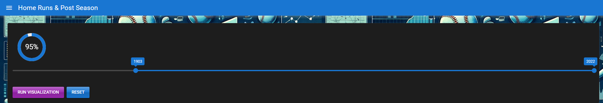
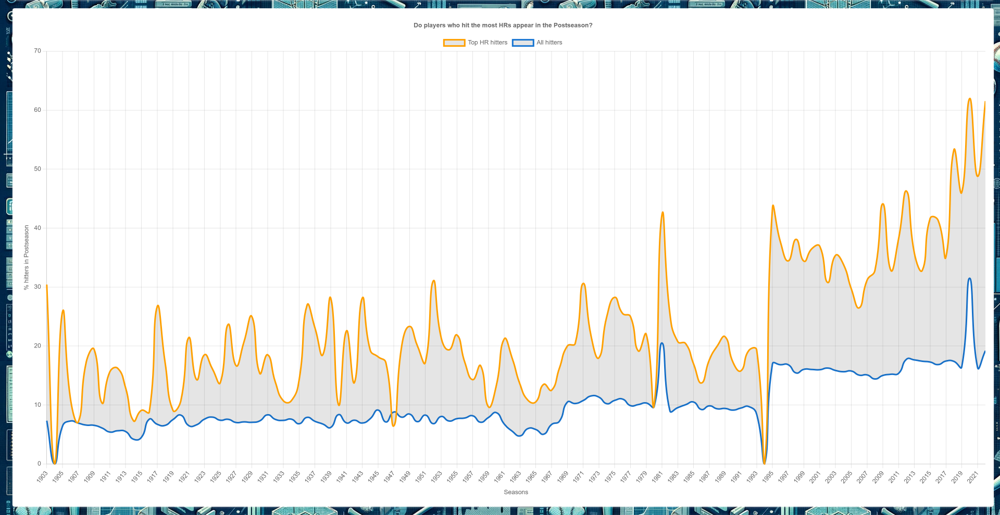
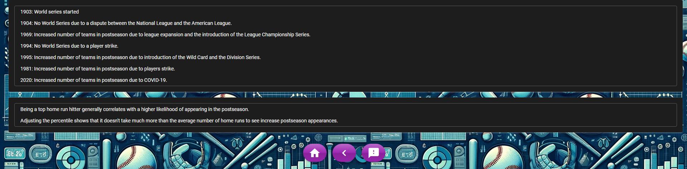

---

### Runs-to-Outs by Salary range

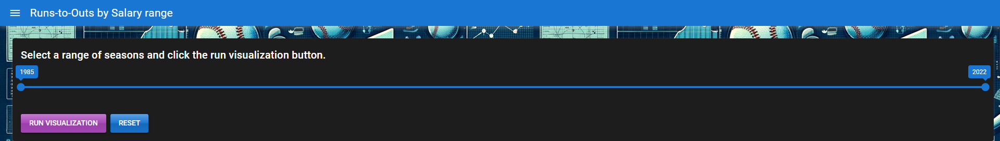
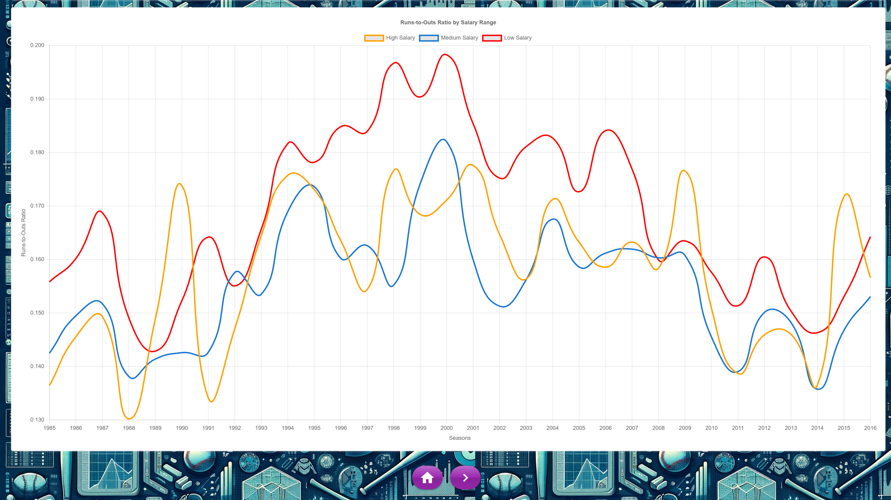

---

### Team Spending Per Win

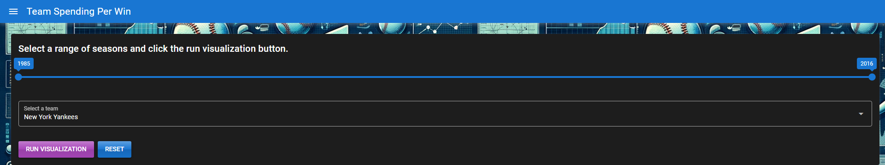
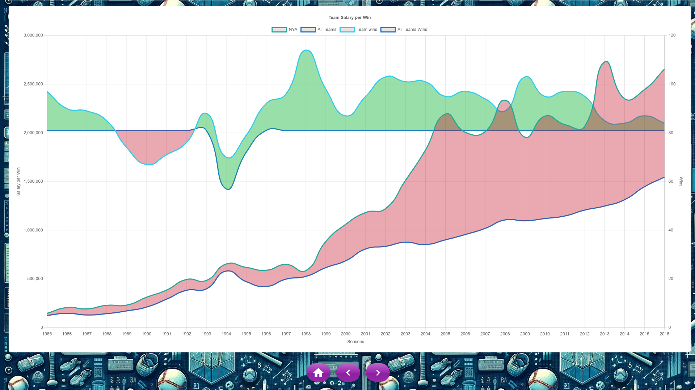

---

### Foreign-born MLB Player Distributions

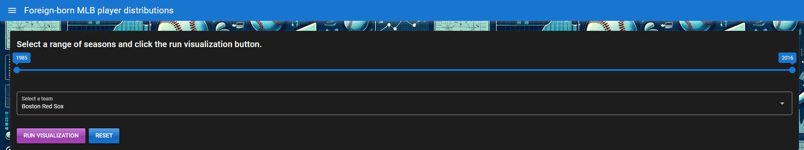
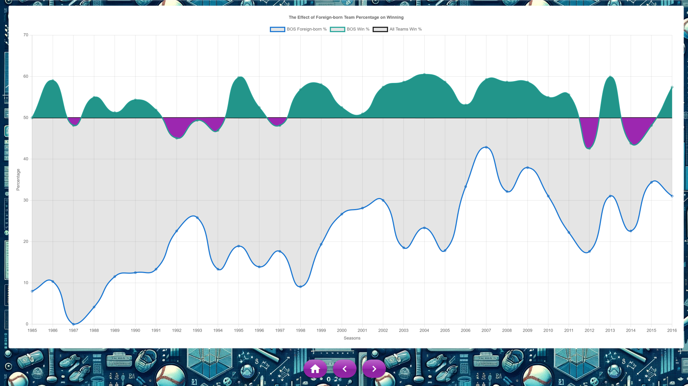

---

### Player Height & Performance

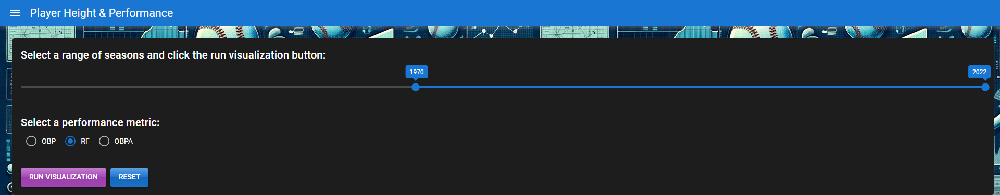
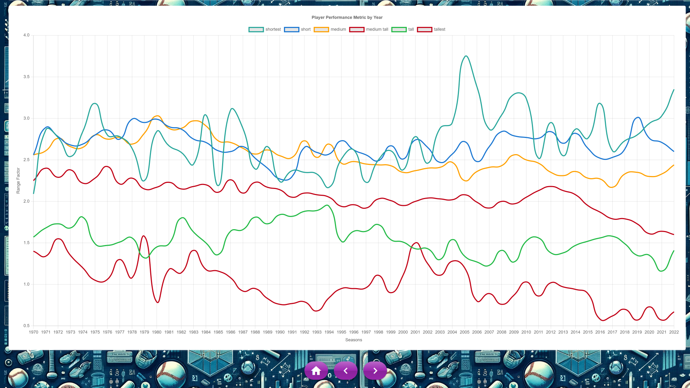

---

### Feedback

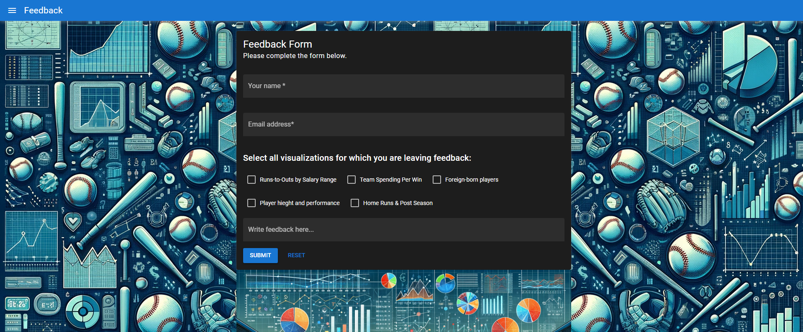

---
